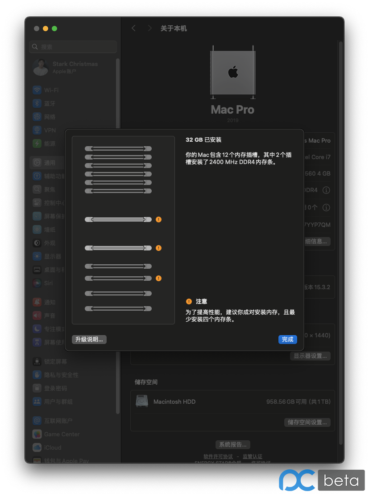
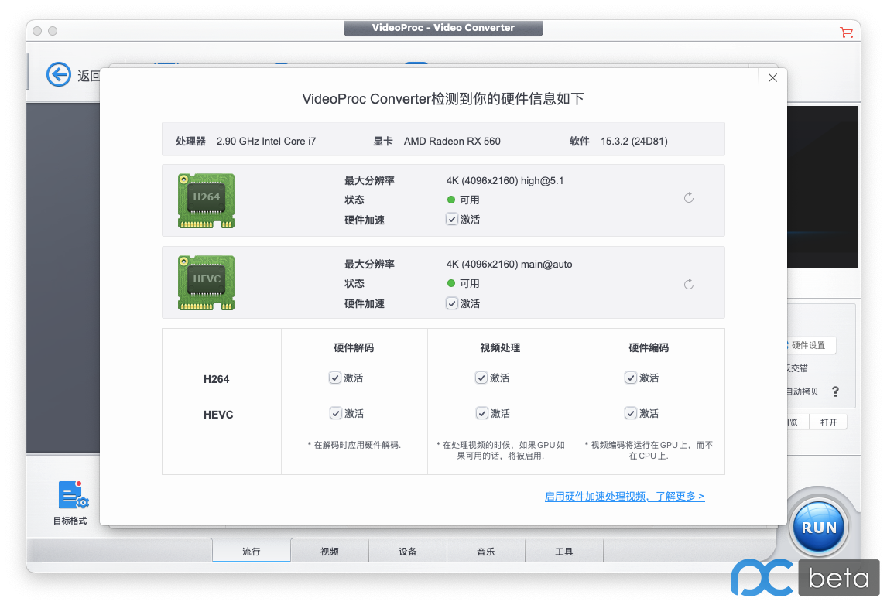
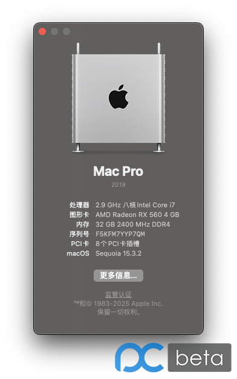

## 系统版本：
macOS Sequoia Version 15.3.2 (24D81）目前最新

## 安装所使用的镜像：
https://bbs.pcbeta.com/viewthread-2036024-1-1.html

该帖子的`OSS`已失效，在`simplehac.cn`网站下载的
镜像版本：
```
Install+macOS+Sequoia+15.3.2+24D81+with+OC104&FirPE+SimpleHac.dmg
```

## U盘制作工作：
```
balenaEtcher-2.1.0.Setup.exe
```

## 功能完成度：

* AMD RT 560 4G 免驱，完美
* BCM94360CS，蓝牙和WiFI完美
* iPhoneMirrors不能使用，随航没有测过，由于有白苹果没有折腾的必要
* 声卡，没怎么折腾，目前完美，没有发现问题
* 睡眠无效，Sleep之后又会启动
* USB注入没搞，加载了相关Kext后，U盘什么的直接识别了
* 定制了内存条识别
* 由于工作仅需要macOS，所以在Opencore设置了开机直接进入macOS，基本实现白苹果
* 在引导参数把-v还有debug去掉了，提高了开机速度
* 其他的好像也没什么了，有想了解的欢迎来提问
---
* 修复通过注入USB定制驱动修复，点击睡眠之后，机器关闭，然后在重启
* 修复关于本机，处理器显示错误问题，目前已和白苹果显示效果一致


 ## 远景论坛原帖
 https://bbs.pcbeta.com/forum.php?mod=viewthread&tid=2036740&page=1#pid56560845

## 成果展示：
### 关于本机


### neofetch


### WiFi及蓝牙成功驱动


### USB成功驱动


### 电源成功驱动


### NVME成功驱动


### 内存成功识别




### 显卡成功识别


显卡解码可用性


### 以太网成功驱动


### 声卡成功驱动


### CPU型号识别




